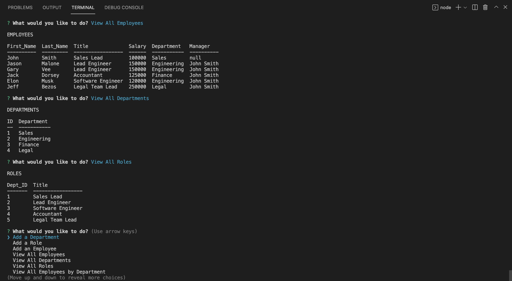

# Employee-tracker
  
  
  Check out the badges hosted by [shields.io](https://shields.io/).
  
  ## Description 
  
  
  A tracker to manage a company's employee database.
  ## Table of Contents
  * [Installation](#installation)
  * [Usage](#usage)
  * [Contributing](#contributing)
  * [Tests](#tests)
  * [License](#license)
  

  ## Screenshot

  

  ## Video

  https://www.dropbox.com/s/9hkup21pfek95yo/Tracker%20DEMO.mov?dl=0
  
  ## Installation
  
  
  Clone repo 
  
  run:
  ```
  npm install 
  npm i inquirer 
  npm i console.table
  ```
  ## Usage 
  
  
  Run 
  ```
  npm start 
  ```
  ## Contributing
  
  
  n/a
  
  ## Tests
  
  
  n/a
  
  ## License
  
  MIT
  
  ---
  
  ## Questions?
  
  
  For any questions, please contact me with the information below:
 
  GitHub: [@juanestuniga](https://api.github.com/users/juanestuniga)